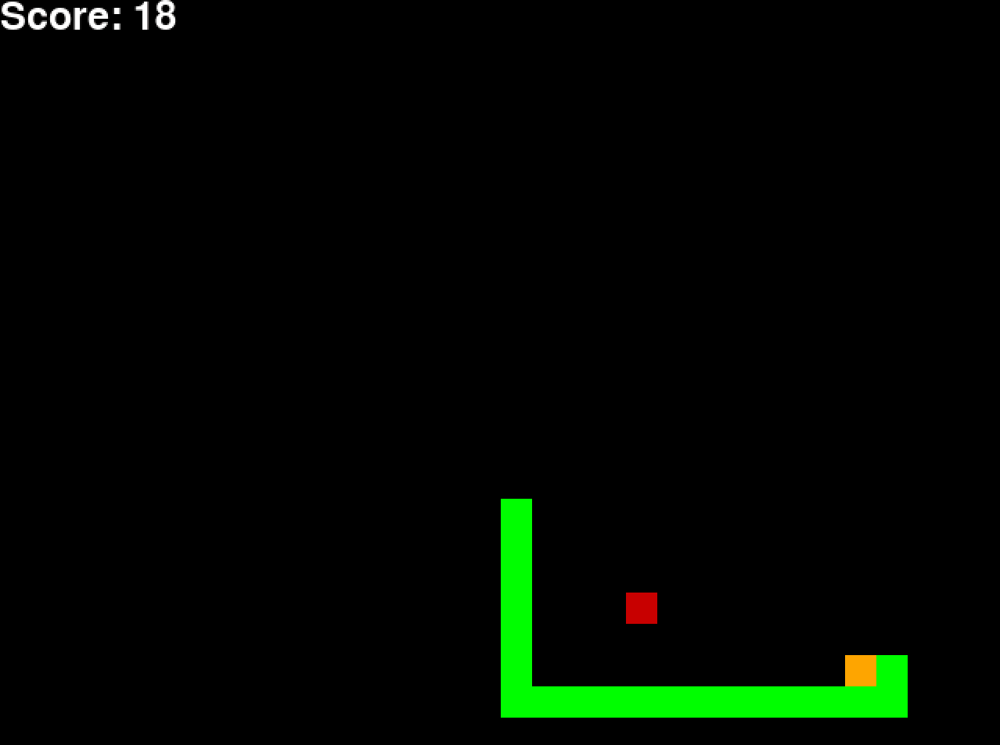
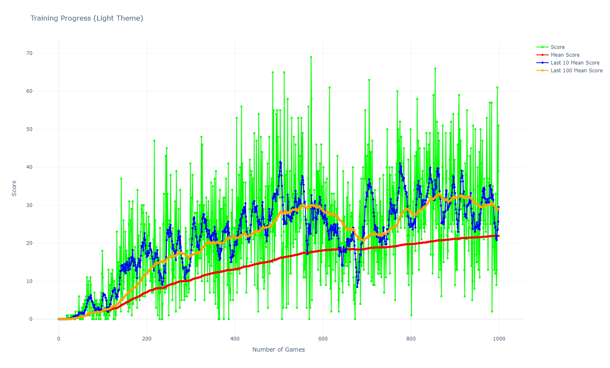
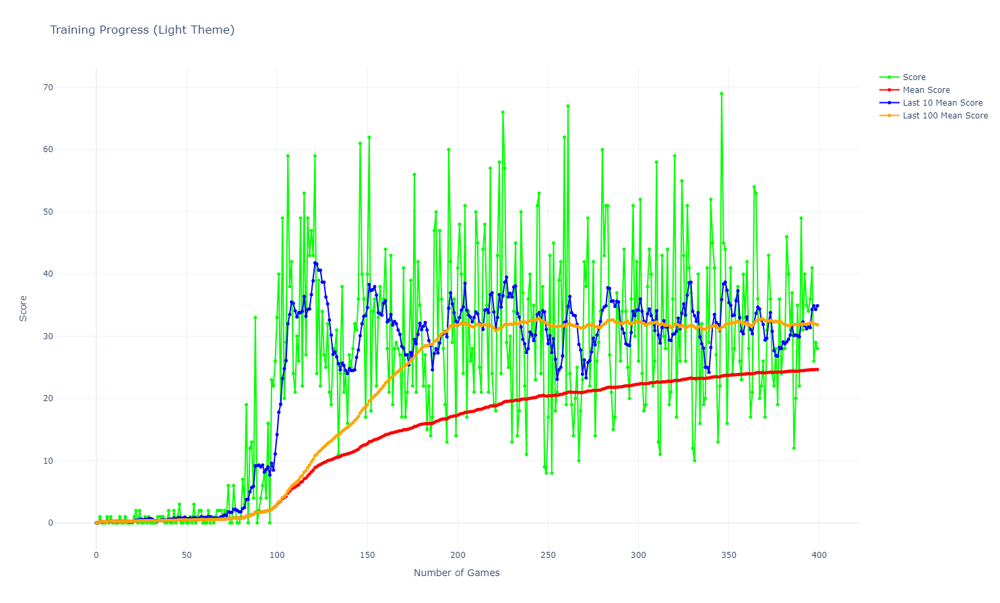

# 🐍 AI Snake Game

Welcome to the AI Snake Game project! This repository showcases various AI methods to play the classic Snake game, including Heuristic, Q-learning, Deep Q-Networks (DQN), and Prioritized Experience Replay (PER). Each method is implemented and evaluated for performance. 



## 🚀 Getting Started
    
First, clone the repository:

```bash
git clone https://github.com/Hisqkq/snake_ai.git
cd snake_ai
```

### Prerequisites

Ensure you have Python installed. You can install the required dependencies using:

```bash
pip install -r requirements.txt
```

## Running the Game

### Play the Game

To play the game by yourself, run:

```bash
python play.py
```

### Heuristic Method

To run the heuristic algorithm playing the Snake game:

```bash
python Heuristic/snake_game_heuristic.py
```

### AI Methods

#### Q-learning

To run the Q-learning algorithm playing the Snake game:

```bash
python Q-learning/train.py
```

#### Deep Q-Networks (DQN)

To run the DQN algorithm playing the Snake game:

```bash
python DQN/train.py
```

#### Prioritized Experience Replay (PER)

To run the PER algorithm playing the Snake game:

```bash
python PER/train.py
```

## Project Description

### What is the Snake Game?

The Snake game is a classic arcade game where the player controls a snake that grows in length as it consumes food. The objective is to guide the snake to eat food while avoiding collisions with walls and its own body. The game ends when the snake collides with a wall or itself.

### Stochastic Environments

The Snake game is a stochastic environment where the outcomes are not entirely predictable. The game involves randomness in the placement of food. The stochastic nature of the Snake game poses challenges for AI agents, requiring them to adapt to changing environments and make decisions under uncertainty.

### Evaluation Metrics

The performance of the AI methods is evaluated using different metrics:
- **Average Score**
- **Variance of Score**
- **Standard Deviation of Score**
- **Maximum Score**
- **Minimum Score**
- **Average Time per Episode**

### Results Comparison

| Metric                | Heuristic | Q-learning | DQN    | PER    |
|-----------------------|-----------|------------|--------|--------|
| **Average Score**     | 15.48     | 30.64      | 29.16  | 32.12  |
| **Variance**          | 67.26     | 170.99     | 152.71 | 172.31 |
| **Standard Deviation**| 8.20      | 13.08      | 12.36  | 13.13  |
| **Maximum Score**     | 41        | 66         | 65     | 69     |
| **Minimum Score**     | 1         | 1          | 1      | 8      |
| **Average Moves**     | 295.60    | 788.80     | 1056.50| 455.50 |

### Example Visualization

The performance of the AI methods is visualized using the following plots:

#### Q-learning Performance Plot




#### PER Performance Plot




The plots show the average score achieved by the AI methods over multiple episodes. This shows the learning progress of the AI agents and their ability to improve their performance over time, and how the methods converge to a stable level of performance.

## Conclusion

By understanding these methods and their performance in a structured manner, we can better appreciate the strengths and weaknesses of each approach and identify the most effective strategy for mastering the Snake game.


